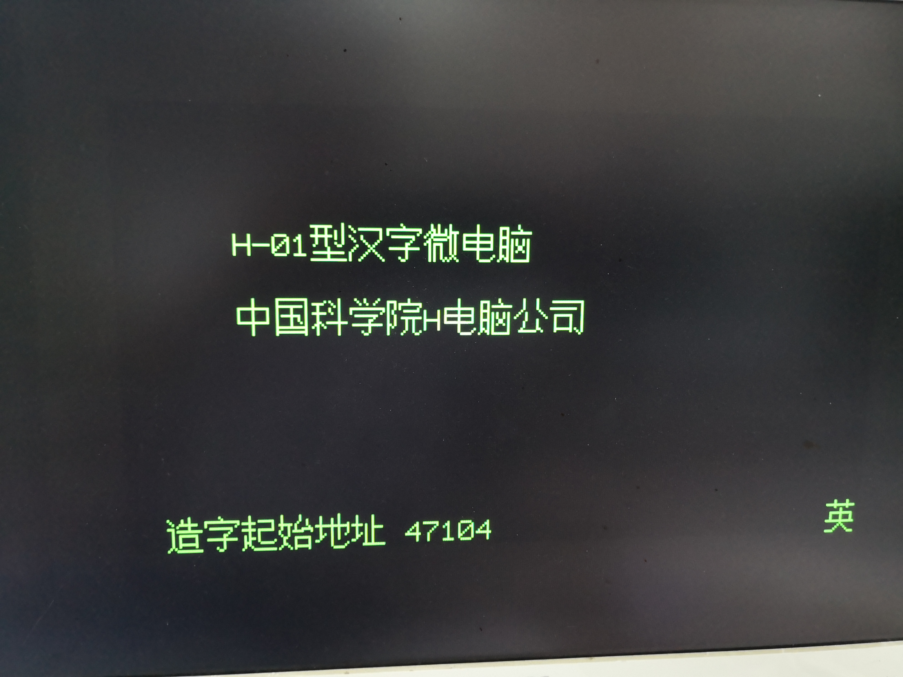

# H-01B FPGA

Welcome to H-01B_FPGA project. This project is an attempt to recreate the once famous H-01B/NF-500A computer in 80's on Altera Cyclone based FPGA boards.

Features implemented:
1. VGA output
2. internal ROM ROM on flash
3. Buzzer output
4. PS/2 keyboard support (Ctrl+F12 to reset).
5. 12.5MHz overclock on SW0

***Planned***

1. 

***Screenshots***  

***Supported boards***

- Terasic DE1
- Terasic DE2

***Folder structures***

